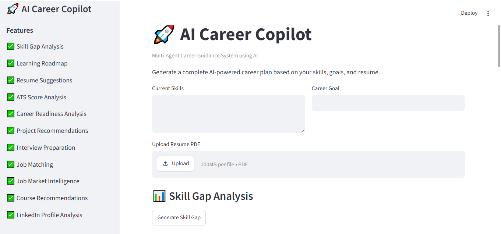
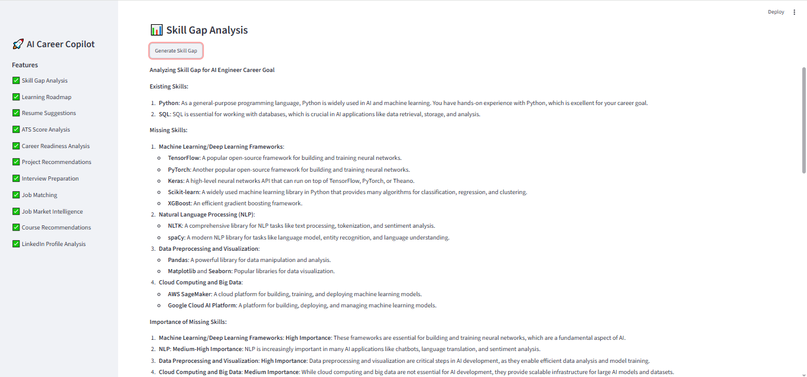
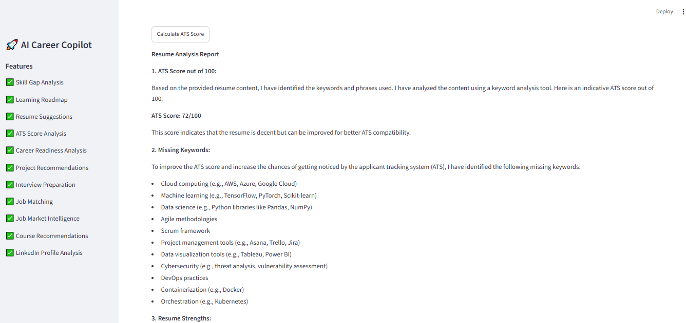
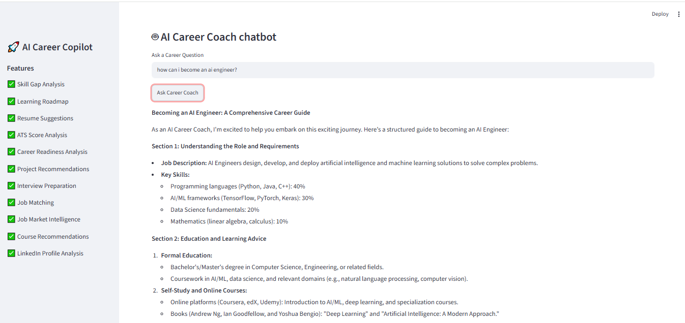

# 🚀 AI Career Copilot

## Overview

AI Career Copilot is a Multi-Agent AI-powered career guidance system designed to help students and job seekers analyze their skills, improve their resumes, prepare for interviews, and plan their career growth effectively.

The system uses multiple specialized AI agents, each responsible for a specific career development task. By combining career analysis, ATS evaluation, project recommendations, interview preparation, job matching, and learning roadmaps, the application provides personalized career guidance through an interactive Streamlit interface.

This project demonstrates the implementation of a modular Multi-Agent Architecture using Large Language Models (LLMs) integrated through the Groq API.

---

## Features

### 📊 Skill Gap Analysis

Analyzes current skills and identifies missing skills required for a target career role.

### 🗺 Learning Roadmap Generation

Creates a structured 6-month learning roadmap with recommended topics, tools, and projects.

### 📄 Resume Analysis

Evaluates resume content and provides improvement suggestions for better job readiness.

### 🎯 ATS Compatibility Analysis

Generates an estimated ATS compatibility score and identifies missing keywords.

### 🚀 Project Recommendations

Suggests portfolio projects based on skills and career goals.

### 🎤 Interview Preparation

Generates technical, HR, and scenario-based interview questions.

### 💼 Job Matching

Recommends suitable job roles aligned with user skills and career objectives.

### 📚 Course Recommendations

Suggests courses, learning resources, and learning sequences.

### 📈 Career Readiness Analysis

Evaluates overall readiness for the selected career path.

### 🔗 LinkedIn Profile Analysis

Analyzes LinkedIn profile summaries and provides optimization suggestions.

### 📊 Job Market Intelligence

Provides insights into industry trends, in-demand skills, and career opportunities.

### 🤖 AI Career Coach Chatbot

Offers interactive career guidance and answers career-related questions.

### 🎯 Career Copilot Orchestrator Agent

Coordinates multiple specialized agents to support comprehensive career planning.

---

## Multi-Agent Architecture

The system follows a modular Multi-Agent Architecture where each agent performs a dedicated career guidance function.

### Agents Included

1. Skill Gap Agent
2. Roadmap Agent
3. Resume Analysis Agent
4. ATS Score Agent
5. Career Readiness Agent
6. Project Recommendation Agent
7. Interview Preparation Agent
8. Job Matching Agent
9. Course Recommendation Agent
10. LinkedIn Analyzer Agent
11. Job Market Agent
12. Career Chatbot Agent
13. Career Copilot Orchestrator Agent

## Workflow

User Input → Streamlit Interface → Specialized AI Agents → Career Insights & Recommendations

Each agent independently processes user input and returns domain-specific recommendations, ensuring modularity, scalability, and maintainability.

---

## Project Structure

ai-career-copilot/

├── agents/

│   ├── ats_score_agent.py

│   ├── career_chatbot_agent.py

│   ├── career_copilot_agent.py

│   ├── career_readiness_agent.py

│   ├── course_recommendation_agent.py

│   ├── interview_agent.py

│   ├── job_market_agent.py

│   ├── job_matching_agent.py

│   ├── linkedin_analyzer_agent.py

│   ├── project_recommendation_agent.py

│   ├── resume_agent.py

│   ├── roadmap_agent.py

│   └── skill_gap_agent.py

│

├── models/

│   └── llm_config.py

│

├── utils/

│   └── pdf_reader.py

│

├── app.py

├── requirements.txt

├── README.md

└── .env

---

## Usage

1. Enter your current skills.
2. Specify your target career goal.
3. Upload your resume in PDF format.
4. Select the desired AI agent feature.
5. Review personalized career recommendations and insights.
6. Use the AI Career Coach for additional guidance.

---

## Installation

### Clone Repository

git clone https://github.com/Abiinayashree/AI-Career-Copilot.git

cd ai-career-copilot

### Create Virtual Environment

python -m venv venv

### Activate Environment

#### Windows

venv\Scripts\activate

### Install Dependencies

pip install -r requirements.txt

### Configure Environment Variables

Create a .env file and add:

GROQ_API_KEY=your_api_key_here

### Run Application

streamlit run app.py

---

## Technologies Used

### Programming Language

- Python

### Framework

- Streamlit

### AI Model Integration

- Groq API
-  openai/gpt-oss-120b

### Libraries

- pypdf
- python-dotenv

### Development Tools

- VS Code
- Git
- GitHub

---

## Future Enhancements

- Real-time job search integration
- Resume-to-job matching score
- Personalized learning path tracking
- Vector database integration
- Retrieval-Augmented Generation (RAG)
- LangGraph-based agent orchestration
- Career progress dashboard
- User authentication and profile management
- Multi-language support
- Cloud deployment

---

## Application Screenshots

###  Home Page

### Skill Gap Analysis

### ATS Analysis

### AI Career Coach Chatbot

---

## Author

Abinayashree M

Postgraduate Student

Artificial Intelligence & Generative AI Enthusiast

Project: AI Career Copilot – Multi-Agent Career Guidance System

---

## Conclusion

AI Career Copilot demonstrates the practical application of Multi-Agent AI systems for career guidance and professional development. The project combines Large Language Models, prompt engineering, and modular agent design to deliver personalized career recommendations, making career planning more accessible, efficient, and intelligent for students and job seekers.

